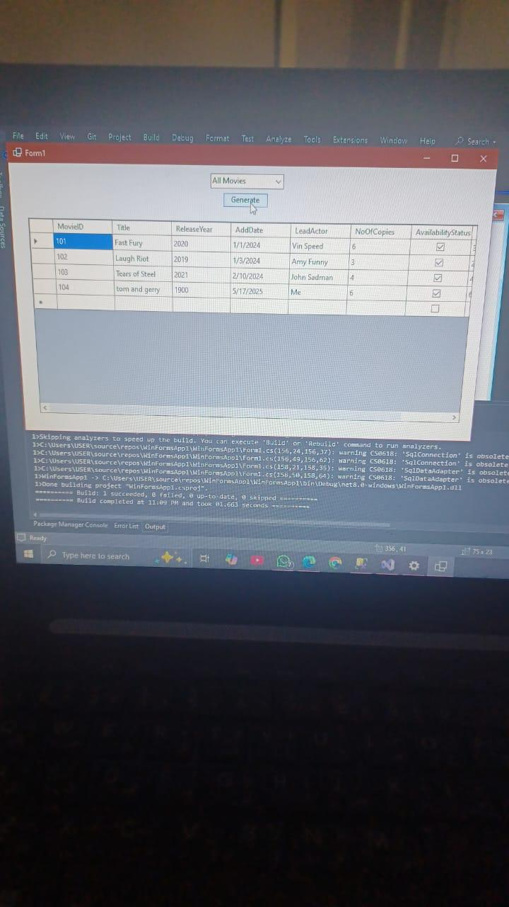
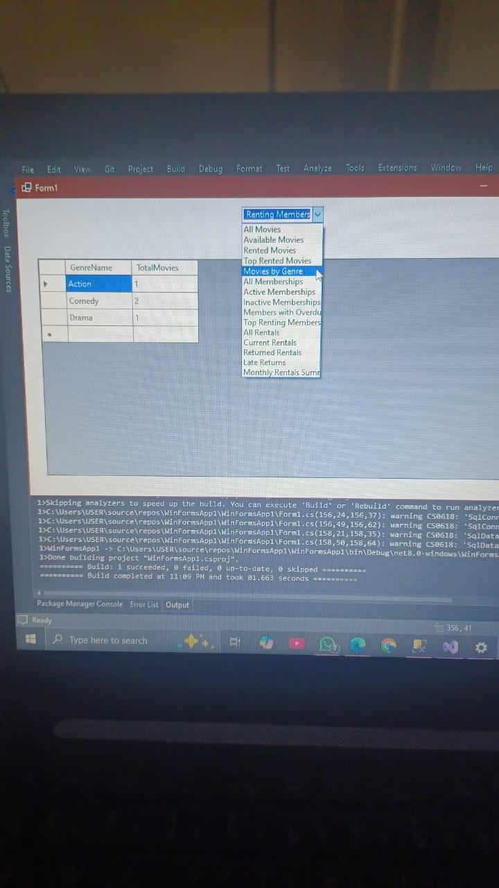
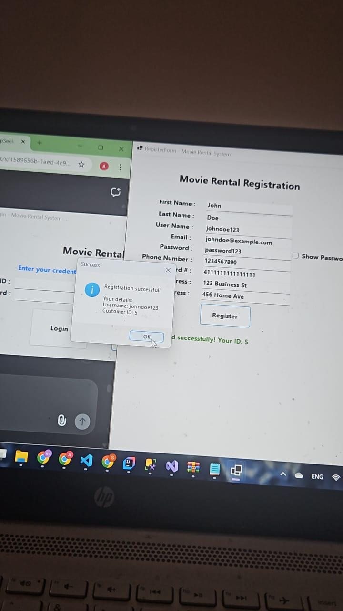

# Movie Rental Management System

A desktop application developed using C# WinForms and SQL Server for managing movie rentals, customers, and inventory.
This project was developed collaboratively as part of a university team project.

## Features
- User authentication
- Movie rental and return management
- Genre management
- Search functionality
- SQL Server database integration
- Admin and user dashboards

## Technologies Used
- C#
- WinForms
- SQL Server
- Visual Studio 2022

## Team Members

Aya Mohsen
Shahd Ossama
Nour Mohamed
MennaTallah Ahmed

## My Role
Developed the application as part of a university software/database project, including GUI development, database integration, and system functionality.

## Screenshots
### Movie Search

### MovieSearch By Genre

### Registration Success

## How to Run
1. Open the solution in Visual Studio
2. Configure the SQL Server connection string
3. Run the database scripts
4. Start the application
